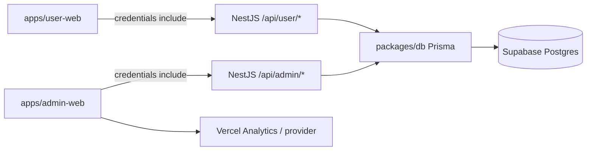

# V2.0.1 - Auth Và Admin Panel

> Trạng thái: bản nghiên cứu, đặc tả và kế hoạch triển khai trước khi code V2.0.1. Spec thắng code.
>
> Quyết định mới: **User và Admin là hai bảng riêng, không có `role` trên `User` hoặc `Admin`**. V2.0.1 chỉ dùng `AuthProvider.PASSWORD`, không verify email. Admin đăng nhập bằng `username`, không dùng email, display name hoặc status.

## 1. Bối Cảnh Hiện Tại

KeyLish V1 là ứng dụng học từ vựng local-first. Backend NestJS hiện đang phục vụ API đọc kho từ vựng:

- User web: `apps/user-web` - Next.js App Router, React, TypeScript.
- API: `apps/api` - NestJS + Express, global prefix `/api`, URI versioning cho V1 vocabulary.
- DB: `packages/db` - Prisma + PostgreSQL (host: **Supabase**).
- Shared: `packages/shared` - Zod schema/type dùng chung.
- Production hiện tại: Vercel web, Render API, **Supabase (Postgres)** — đổi từ Neon để tránh trần compute-hour của Neon free; xem §3.

API đã được tổ chức lại theo module cho V1 vocabulary/health/database. V2.0.1 sẽ đi tiếp bằng cách thêm auth domain và admin panel mà không phá các route public hiện tại:

- `/api/v1/topics`
- `/api/v1/vocab`
- `/api/v1/vocab/count`

## 2. Phạm Vi V2.0.1

V2.0.1 tập trung vào 2 trục:

- Auth nền tảng cho người học và admin.
- Admin panel để xem/kiểm soát tài nguyên hiện có: user, topic, vocab và traffic ở mức dashboard.

Trong phạm vi V2.0.1:

- User đăng ký/đăng nhập bằng email + password.
- User có `/api/user/login` và `/api/user/profile`.
- User không cần email verification trong V2.0.1.
- Admin đăng nhập bằng username + password qua `/api/admin/login`.
- Admin không có `email`, `displayName`, `status` hoặc `role`.
- Không có `AdminStatus`.
- Không có `/api/admin/profile`.
- Chỉ hỗ trợ `AuthProvider.PASSWORD`.
- Admin panel tách thành app riêng: `apps/admin-web`.
- App web người học đổi tên từ `apps/web` thành `apps/user-web`.

Ngoài phạm vi V2.0.1:

- Chưa làm OAuth/Google/GitHub/passkey.
- Chưa làm email verification.
- Chưa làm MFA cho admin.
- Chưa làm billing/subscription.
- Chưa làm hệ thống monitoring/alert/audit phức tạp riêng.
- Không lưu token auth trong `localStorage`, `sessionStorage` hoặc IndexedDB.
- Chưa mở public registration cho admin; admin được tạo bằng seed/script nội bộ.
- Chưa làm model dữ liệu học tập (personal vocab, kho bài, progress/SRS). Khi auth, **tuyệt đối không** tạo bảng/ghi **raw review-event** (log từng lượt gõ/đúng-sai) vào Postgres — xem ghi chú free tier ở §8.

Ghi chú về "giám sát": V2.0.1 không xây một subsystem monitoring/alert riêng. Admin panel chỉ cần dashboard vận hành ở mức sản phẩm: tổng quan user/topic/vocab và traffic lấy từ Vercel Analytics hoặc nguồn analytics tương đương.

## 3. Quyết Định Kiến Trúc

Chọn hướng: **API sở hữu auth, session cookie HttpOnly, session state nằm trong Postgres**.

Quyết định domain:

- `User` và `Admin` là hai bảng riêng.
- Không dùng `role` field trên `User` hoặc `Admin`.
- User session và admin session tách riêng.
- User endpoint dùng prefix `/api/user/*`.
- Admin endpoint dùng prefix `/api/admin/*`.
- Existing V1 vocabulary endpoint vẫn giữ `/api/v1/*`.
- Admin panel gọi admin API riêng; user web không gọi admin API.

Lý do tách bảng:

- Tránh nhầm lẫn giữa tài khoản người học và tài khoản vận hành.
- Không cần kiểm tra role ở mọi request; guard/module đã quyết định domain.
- Admin có mô hình dữ liệu tối giản hơn user: chỉ cần `username` và credential.
- User data ownership rõ ràng hơn: mọi dữ liệu học tập gắn với `userId`, không bao giờ gắn với admin.

Trade-off:

- Schema và service sẽ trùng lặp một phần giữa user/admin.
- Khi thêm OAuth/passkey ở V2.1+ cần mở rộng theo từng domain hoặc tạo helper dùng chung.
- Admin không có profile endpoint nên admin panel không nên phụ thuộc vào thông tin cá nhân admin để render UI.



### Hạ tầng dữ liệu: Supabase (chỉ dùng làm Postgres host)

Chuyển DB từ **Neon** sang **Supabase** để thoát **trần compute-hour của Neon free** (app đã có user thật, chạy active). **Chỉ dùng Supabase như Postgres host — KHÔNG dùng Supabase Auth/GoTrue/RLS.** Auth vẫn do NestJS tự quản đúng thiết kế trong doc này (session lưu bảng Postgres, cookie `__Host-`), nên đổi host **không đụng** logic auth.

Mô hình kết nối (Prisma + Supabase):

| Env            | Dùng cho               | Endpoint Supabase                                  |
| -------------- | ---------------------- | -------------------------------------------------- |
| `DATABASE_URL` | runtime app (NestJS)   | **Transaction pooler** `:6543` + `?pgbouncer=true` |
| `DIRECT_URL`   | `prisma migrate` / CLI | **Session pooler** `:5432`                         |

- ⚠️ **IPv4/IPv6:** Render outbound chỉ IPv4, còn **Direct connection của Supabase là IPv6-only** → cả app lẫn migrate đều đi qua **pooler**, không dùng direct host. (`prisma.config.ts` đã ưu tiên `DIRECT_URL` cho CLI.)
- Supabase **luôn-bật** (không autosuspend mỗi 5' như Neon) → **hết cold start phía DB**; chỉ còn cold start của **Render** (prewarm phía web lo).
- **Pause & keep-alive:** free **pause sau 7 ngày không hoạt động** (restore **thủ công**, warming UI không đánh thức được). Đã có cron `.github/workflows/keepalive.yml` ping `/api/v1/vocab/count` (chạm DB) mỗi 12h để chặn pause.
- **Free tier:** ~0.5 GB storage, CPU shared, egress giới hạn → giữ schema lean, **không log raw review-event** (xem §8).

## 4. App Và Package Layout

Layout mục tiêu:

```txt
apps/
  api/
  user-web/
  admin-web/
packages/
  db/
  shared/
```

Rename web hiện tại:

| Hiện tại            | Mục tiêu            | Ghi chú                            |
| ------------------- | ------------------- | ---------------------------------- |
| `apps/web`          | `apps/user-web`     | Web học từ vựng dành cho người học |
| `@keylish/web`      | `@keylish/user-web` | Đổi package name và root scripts   |
| `pnpm dev:web`      | `pnpm dev:user-web` | Có thể giữ alias `dev:web` tạm     |
| Vercel project root | `apps/user-web`     | Cập nhật setting deploy            |

Thêm admin app:

| App              | Package name         | Vai trò                                   |
| ---------------- | -------------------- | ----------------------------------------- |
| `apps/admin-web` | `@keylish/admin-web` | Dashboard vận hành và quản trị tài nguyên |

Package/dependency gợi ý:

| Package             | Dùng ở           | Mục đích                                                       |
| ------------------- | ---------------- | -------------------------------------------------------------- |
| `antd`              | `apps/admin-web` | UI dashboard/table/form nhanh, không phụ thuộc design hiện tại |
| `@ant-design/icons` | `apps/admin-web` | Icon đồng bộ với Ant Design                                    |
| `@vercel/analytics` | user/admin web   | Gửi traffic event lên Vercel Analytics nếu deploy trên Vercel  |
| `@keylish/shared`   | cả hai web app   | DTO/schema dùng chung nếu cần                                  |

Nguyên tắc package:

- `pnpm-workspace.yaml` đang match `apps/*`, nên `apps/user-web` và `apps/admin-web` tự nằm trong workspace.
- Root scripts cần đổi filter từ `@keylish/web` sang `@keylish/user-web`.
- Admin app không cần Tailwind/design system hiện tại nếu Ant Design đáp ứng đủ.
- Nếu Ant Design cần SSR style registry với Next App Router, thêm package registry tương ứng khi triển khai.

## 5. Domain, Cookie Và CORS

Production auth nên có custom domain để tránh third-party cookie và CORS khó debug:

| Thành phần | Khuyến nghị                                                 |
| ---------- | ----------------------------------------------------------- |
| User web   | `https://app.keylish.com` hoặc `https://keylish.com`        |
| Admin web  | `https://admin.keylish.com`                                 |
| API        | `https://api.keylish.com`                                   |
| Cookie     | Set từ API, chỉ gửi về API                                  |
| CORS       | Allow-list origin thật, `credentials: true`, không wildcard |

Cookie production tách theo domain:

| Cookie          | Dùng cho | Giá trị                                                      |
| --------------- | -------- | ------------------------------------------------------------ |
| `__Host-user`   | User     | User session token ngẫu nhiên, không chứa user id/email      |
| `__Host-admin`  | Admin    | Admin session token ngẫu nhiên, không chứa admin id/username |
| `__Host-u-csrf` | User     | CSRF helper cookie nếu dùng double-submit                    |
| `__Host-a-csrf` | Admin    | CSRF helper cookie nếu dùng double-submit                    |

Thuộc tính cookie:

| Thuộc tính | Giá trị                                                         |
| ---------- | --------------------------------------------------------------- |
| HttpOnly   | `true` cho session cookie                                       |
| Secure     | `true` ở production                                             |
| SameSite   | `Lax` khi web/API cùng site; `None` chỉ khi bắt buộc cross-site |
| Path       | `/`                                                             |
| Domain     | Không set domain nếu dùng prefix `__Host-`                      |
| Max-Age    | Theo idle timeout của từng loại session                         |

Development local:

- User web: `http://localhost:3000`.
- Admin web: `http://localhost:3002`.
- API: `http://localhost:3001`.
- Cookie dev có thể dùng name `user` và `admin`, `secure: false`, `sameSite: "lax"`.
- API `enableCors` phải thêm `credentials: true` và allow origin cụ thể.

Cập nhật cần có trong `apps/api/src/main.ts` khi implement V2.0.1:

```ts
app.enableCors({
  origin: allowedOrigins,
  credentials: true,
  methods: ["GET", "POST", "PATCH", "PUT", "DELETE", "OPTIONS"],
  allowedHeaders: ["Content-Type", "X-CSRF-Token"],
});
```

## 6. CSRF Và Request An Toàn

Vì V2.0.1 dùng cookie auth, mọi unsafe method phải có CSRF protection.

Baseline:

- User lấy CSRF qua `GET /api/user/csrf`.
- Admin lấy CSRF qua `GET /api/admin/csrf`.
- Client gửi token qua header `X-CSRF-Token` cho `POST`, `PATCH`, `PUT`, `DELETE`.
- API dùng signed double-submit cookie hoặc thư viện tương đương; token được bind với session domain tương ứng.
- API kiểm tra `Origin`/`Referer` cho unsafe methods.
- `SameSite=Lax` là lớp phòng thủ bổ sung, không phải cơ chế duy nhất.

## 7. Password Policy

V2.0.1 hỗ trợ password auth duy nhất.

User password policy:

- Minimum 12 ký tự.
- Cho phép Unicode, dấu cách và passphrase.
- Không bắt buộc composition rule kiểu chữ hoa/số/ký tự đặc biệt.
- Maximum 128 ký tự, không silent truncate.
- Login trả lỗi generic, không tiết lộ email tồn tại hay không.

Admin password policy:

- Minimum 15 ký tự.
- Không có public registration.
- Admin đầu tiên được tạo bằng seed/script nội bộ.
- V2.1+ mới cân nhắc MFA hoặc passkey cho admin.

Password storage:

- Dùng Argon2id nếu môi trường deploy hỗ trợ native package.
- Tham số baseline: memory 19 MiB, iterations 2, parallelism 1; tăng dần nếu latency cho phép.
- Nếu Argon2id gây vấn đề build native, dùng `bcrypt` tạm thời với cost >= 12 và ghi rõ trade-off trong ADR.
- Session/reset token chỉ lưu hash trong DB; token plaintext chỉ gửi một lần.

## 8. Schema Prisma Đề Xuất

Thêm vào `packages/db/prisma/schema.prisma` trong migration V2.0.1. Không có `role` field trong `User` hoặc `Admin`. Không có `AdminStatus`.

```prisma
enum UserStatus {
  ACTIVE
  DISABLED
  DELETED
}

enum AuthProvider {
  PASSWORD
}

model User {
  id              String     @id @default(cuid())
  email           String     @unique
  emailNormalized String     @unique
  displayName     String?
  avatarUrl       String?
  status          UserStatus @default(ACTIVE)
  createdAt       DateTime   @default(now())
  updatedAt       DateTime   @updatedAt
  deletedAt       DateTime?

  identities      UserIdentity[]
  sessions        UserSession[]
  tokens          UserAuthToken[]
}

model Admin {
  id                 String   @id @default(cuid())
  username           String   @unique
  usernameNormalized String   @unique
  passwordChangedAt  DateTime?
  createdAt          DateTime @default(now())
  updatedAt          DateTime @updatedAt

  identities         AdminIdentity[]
  sessions           AdminSession[]
}

model UserIdentity {
  id           String       @id @default(cuid())
  userId       String
  provider     AuthProvider @default(PASSWORD)
  providerId   String
  passwordHash String
  createdAt    DateTime     @default(now())
  updatedAt    DateTime     @updatedAt

  user         User         @relation(fields: [userId], references: [id], onDelete: Cascade)

  @@unique([provider, providerId])
  @@index([userId])
}

model AdminIdentity {
  id           String       @id @default(cuid())
  adminId      String
  provider     AuthProvider @default(PASSWORD)
  providerId   String
  passwordHash String
  createdAt    DateTime     @default(now())
  updatedAt    DateTime     @updatedAt

  admin        Admin        @relation(fields: [adminId], references: [id], onDelete: Cascade)

  @@unique([provider, providerId])
  @@index([adminId])
}

model UserSession {
  id             String    @id @default(cuid())
  userId         String
  tokenHash      String    @unique
  csrfSecretHash String?
  userAgent      String?
  ipHash         String?
  createdAt      DateTime  @default(now())
  lastSeenAt     DateTime  @default(now())
  expiresAt      DateTime
  revokedAt      DateTime?

  user           User      @relation(fields: [userId], references: [id], onDelete: Cascade)

  @@index([userId])
  @@index([expiresAt])
  @@index([revokedAt])
}

model AdminSession {
  id             String    @id @default(cuid())
  adminId        String
  tokenHash      String    @unique
  csrfSecretHash String?
  userAgent      String?
  ipHash         String?
  createdAt      DateTime  @default(now())
  lastSeenAt     DateTime  @default(now())
  expiresAt      DateTime
  revokedAt      DateTime?

  admin          Admin     @relation(fields: [adminId], references: [id], onDelete: Cascade)

  @@index([adminId])
  @@index([expiresAt])
  @@index([revokedAt])
}

model UserAuthToken {
  id        String   @id @default(cuid())
  userId    String
  purpose   String
  tokenHash String   @unique
  expiresAt DateTime
  usedAt    DateTime?
  createdAt DateTime @default(now())

  user      User     @relation(fields: [userId], references: [id], onDelete: Cascade)

  @@index([userId, purpose])
  @@index([expiresAt])
}
```

Ghi chú:

- `emailNormalized` = lowercase + trim; không dùng email display làm khóa logic.
- `usernameNormalized` = lowercase + trim; admin login dùng username, không dùng email.
- `AuthProvider` chỉ có `PASSWORD` trong V2.0.1 để giữ đường mở rộng cho V2.1+.
- `providerId` của password user là `emailNormalized`.
- `providerId` của password admin là `usernameNormalized`.
- `tokenHash` dùng HMAC-SHA256 hoặc SHA-256 trên token ngẫu nhiên 256-bit + server pepper.
- `ipHash` không lưu IP thô nếu chưa có nhu cầu vận hành rõ ràng.
- Mọi model học tập/progress chỉ liên kết với `userId`, không liên kết với `adminId`.
- **Guardrail free tier — KHÔNG đưa raw review-event vào DB chính.** Giai đoạn auth tạo **đúng các bảng auth** ở §8, không thêm bảng review/event/progress nào. Khi V2 mở học tập: chỉ lưu **SRS state hiện tại theo (user, word)**, ưu tiên **local-first + sync snapshot nén**; nếu cần phân tích thì đẩy event sang sink riêng, không để trong Postgres. Lý do: bảng `user × word` và event log phình **cấp số nhân**, dễ vượt free tier (~0.5 GB storage của Supabase free, CPU shared). Từ kho chung thì **tham chiếu `Word.id`**, không copy cả dòng.
- Admin không có public signup; tạo bằng seed, CLI script hoặc migration có secret một lần.

## 9. API Contract V2.0.1

V2.0.1 auth routes đi trực tiếp dưới global prefix `/api`, không dùng `/api/v2/auth/*`.

User DTO tối thiểu:

```ts
type UserProfileDto = {
  id: string;
  email: string;
  displayName: string | null;
  avatarUrl: string | null;
};
```

Admin login request:

```ts
type AdminLoginRequestDto = {
  username: string;
  password: string;
};
```

Admin login response không cần profile:

```ts
type AdminLoginResponseDto = {
  ok: true;
};
```

User endpoints:

| Method | Path                        | Auth     | CSRF | Mô tả                               |
| ------ | --------------------------- | -------- | ---- | ----------------------------------- |
| GET    | `/api/user/csrf`            | optional | no   | Cấp CSRF token cho user flow        |
| POST   | `/api/user/register`        | no       | yes  | Tạo user + password identity        |
| POST   | `/api/user/login`           | no       | yes  | Xác thực user, set user session     |
| POST   | `/api/user/logout`          | yes      | yes  | Revoke current user session         |
| POST   | `/api/user/logout-all`      | yes      | yes  | Revoke tất cả user sessions         |
| GET    | `/api/user/profile`         | yes      | no   | Trả user profile hiện tại           |
| PATCH  | `/api/user/profile`         | yes      | yes  | Cập nhật display name/avatar        |
| POST   | `/api/user/forgot-password` | no       | yes  | Gửi email reset nếu account tồn tại |
| POST   | `/api/user/reset-password`  | no       | yes  | Reset bằng token, revoke sessions   |
| POST   | `/api/user/change-password` | yes      | yes  | Yêu cầu mật khẩu hiện tại           |

Admin auth endpoints:

| Method | Path                         | Auth     | CSRF | Mô tả                         |
| ------ | ---------------------------- | -------- | ---- | ----------------------------- |
| GET    | `/api/admin/csrf`            | optional | no   | Cấp CSRF token cho admin flow |
| POST   | `/api/admin/login`           | no       | yes  | Xác thực admin bằng username  |
| POST   | `/api/admin/logout`          | yes      | yes  | Revoke current admin session  |
| POST   | `/api/admin/logout-all`      | yes      | yes  | Revoke tất cả admin sessions  |
| POST   | `/api/admin/change-password` | yes      | yes  | Đổi mật khẩu admin            |

Không tạo endpoint:

- `GET /api/admin/profile`
- `PATCH /api/admin/profile`
- `POST /api/admin/register`

Admin resource endpoints mục tiêu:

| Method | Path                           | Mô tả                                           |
| ------ | ------------------------------ | ----------------------------------------------- |
| GET    | `/api/admin/dashboard/summary` | Tổng quan số user/topic/vocab và trạng thái API |
| GET    | `/api/admin/users`             | Danh sách user, filter/search/pagination        |
| GET    | `/api/admin/users/:id`         | Chi tiết user và thống kê học tập cơ bản        |
| PATCH  | `/api/admin/users/:id`         | Cập nhật trạng thái user nếu V2.0.1 cần         |
| GET    | `/api/admin/topics`            | Quản lý topic                                   |
| POST   | `/api/admin/topics`            | Tạo topic                                       |
| PATCH  | `/api/admin/topics/:id`        | Sửa topic                                       |
| DELETE | `/api/admin/topics/:id`        | Xóa topic có kiểm tra ràng buộc                 |
| GET    | `/api/admin/vocab`             | Quản lý vocab, filter/search/pagination         |
| POST   | `/api/admin/vocab`             | Tạo word                                        |
| PATCH  | `/api/admin/vocab/:id`         | Sửa word                                        |
| DELETE | `/api/admin/vocab/:id`         | Xóa word có kiểm tra ràng buộc                  |
| GET    | `/api/admin/analytics/traffic` | Aggregate traffic nếu cần proxy analytics       |

V1 vocab endpoint vẫn public: `/api/v1/topics`, `/api/v1/vocab`, `/api/v1/vocab/count`.

## 10. NestJS Module Design

Đề xuất tối giản theo kiểu hiện có: mỗi domain chính một module, mỗi module một controller/service rõ ràng. Auth chỉ giữ login/logout/session/password; resource controller nằm ở resource module.

```txt
apps/api/src/auth/
  auth.module.ts
  auth.controller.ts
  auth.service.ts
  auth.dto.ts

apps/api/src/vocab/
  vocab.module.ts
  vocab.controller.ts
  vocab.service.ts

apps/api/src/topic/
  topic.module.ts
  topic.controller.ts
  topic.service.ts

apps/api/src/admin/
  admin.module.ts
  admin-users.controller.ts
  admin-dashboard.controller.ts
```

Responsibilities:

- `AuthModule`: module duy nhất cho auth, không tách user-auth/admin-auth.
- `AuthController`: một file chứa toàn bộ endpoint auth của user/admin: login, logout, profile, change-password, csrf, register/reset nếu có.
- `AuthService`: một service duy nhất xử lý toàn bộ auth logic cho cả user/admin; helper hash password, token, CSRF và request metadata để private trong service trước, chỉ tách khi thật sự quá dày.
- `VocabModule`: public/user/admin vocab endpoints; một controller đủ, guard và DTO quyết định hành vi.
- `TopicModule`: public/admin topic endpoints; một controller đủ.
- `AdminModule`: dashboard và user management, không đụng auth.
- Nếu sau này có preferences/progress riêng, chúng nên vào resource module tương ứng thay vì quay về auth.

Không đưa Prisma model raw về controller. Mọi service trả DTO hoặc domain object đã sanitize.

## 11. Web Integration

### User Web

Mục tiêu rename:

```txt
apps/user-web/src/app/(auth)/login/page.tsx
apps/user-web/src/app/(auth)/register/page.tsx
apps/user-web/src/app/(auth)/forgot-password/page.tsx
apps/user-web/src/app/(auth)/reset-password/page.tsx
apps/user-web/src/app/(app)/settings/account/page.tsx
apps/user-web/src/infra/user/userApi.ts
apps/user-web/src/infra/user/session.ts
```

Rules:

- User fetch dùng `/api/user/*`, `credentials: "include"`.
- Không đọc session cookie bằng JS; user UI lấy profile qua `/api/user/profile`.
- Không lưu access token trong `localStorage`.
- Sidebar hiện trạng thái đăng nhập dựa trên `/api/user/profile`.

### Admin Web

Mục tiêu app mới:

```txt
apps/admin-web/src/app/login/page.tsx
apps/admin-web/src/app/(dashboard)/page.tsx
apps/admin-web/src/app/(dashboard)/users/page.tsx
apps/admin-web/src/app/(dashboard)/topics/page.tsx
apps/admin-web/src/app/(dashboard)/vocab/page.tsx
apps/admin-web/src/app/(dashboard)/analytics/page.tsx
apps/admin-web/src/infra/admin/adminApi.ts
apps/admin-web/src/infra/admin/session.ts
```

Rules:

- Admin fetch dùng `/api/admin/*`, `credentials: "include"`.
- Admin login form dùng `username` + `password`.
- Không gọi `/api/admin/profile`.
- Admin layout kiểm tra session bằng protected dashboard request; nếu 401 thì redirect login.
- Có thể dùng Ant Design cho table, form, layout, pagination và modal.
- Admin panel không cần áp dụng design system hiện tại của user web.
- Admin page phải tối ưu cho thao tác dữ liệu: bảng dày vừa phải, filter rõ, thao tác batch sau V2.0.1 nếu cần.

## 12. Authorization Policy

Không dùng role. Authorization dựa trên **domain + guard + ownership**.

| Domain | Guard        | Session table  | Cookie         | Quyền                                   |
| ------ | ------------ | -------------- | -------------- | --------------------------------------- |
| User   | `UserGuard`  | `UserSession`  | `__Host-user`  | Ghi/xem dữ liệu học tập của chính mình  |
| Admin  | `AdminGuard` | `AdminSession` | `__Host-admin` | Quản trị user/topic/vocab qua admin API |

Rules:

- `UserGuard` không bao giờ chấp nhận admin cookie.
- `AdminGuard` không bao giờ chấp nhận user cookie.
- Mọi query user-owned data phải filter theo `userId` từ `request.user`, không tin `userId` từ body/client.
- Admin muốn xem/sửa dữ liệu user phải đi qua endpoint admin riêng.
- DTO không bao giờ trả `passwordHash`, `tokenHash`, reset token, ipHash, internal metadata.
- Sensitive action như đổi email, đổi password, delete account cần re-auth hoặc password confirm.

## 13. Rate Limit Và Logging Cơ Bản

V2.0.1 chưa cần hệ thống giám sát/audit riêng, nhưng vẫn cần rate limit và log lỗi bảo mật ở mức tối thiểu.

| Flow                 | Giới hạn đề xuất                                          |
| -------------------- | --------------------------------------------------------- |
| User login           | Per IP + per email, exponential backoff sau nhiều lần sai |
| User register        | Per IP/email                                              |
| User forgot password | Per IP/email, response generic                            |
| Admin login          | Per IP + per username, chặt hơn user                      |
| CSRF token           | Per session/IP nhẹ                                        |

Không log password, token plaintext, raw cookie, reset link đầy đủ, hoặc PII không cần thiết.

## 14. Env Vars V2.0.1

Thêm vào `.env.example` và production secrets khi implement:

```env
# Database (Supabase) — app qua transaction pooler, migrate qua session pooler
DATABASE_URL=postgresql://postgres.<ref>:<pw>@aws-0-<region>.pooler.supabase.com:6543/postgres?pgbouncer=true
DIRECT_URL=postgresql://postgres.<ref>:<pw>@aws-0-<region>.pooler.supabase.com:5432/postgres

# Auth common
AUTH_ALLOWED_ORIGINS=http://localhost:3000,http://localhost:3002,https://app.keylish.com,https://admin.keylish.com
AUTH_SESSION_SECRET=<openssl-rand-base64-32-or-longer>
AUTH_CSRF_SECRET=<openssl-rand-base64-32-or-longer>

# User auth
AUTH_USER_COOKIE_NAME=__Host-user
AUTH_USER_CSRF_COOKIE_NAME=__Host-u-csrf
AUTH_USER_SESSION_IDLE_DAYS=30
AUTH_USER_SESSION_ABSOLUTE_DAYS=90

# Admin auth
AUTH_ADMIN_COOKIE_NAME=__Host-admin
AUTH_ADMIN_CSRF_COOKIE_NAME=__Host-a-csrf
AUTH_ADMIN_SESSION_IDLE_HOURS=12
AUTH_ADMIN_SESSION_ABSOLUTE_DAYS=30
ADMIN_INITIAL_USERNAME=
ADMIN_INITIAL_PASSWORD=

# Optional email reset only
EMAIL_PROVIDER=resend
EMAIL_FROM=KeyLish <no-reply@keylish.com>
RESEND_API_KEY=

# Optional hardening
AUTH_ARGON2_MEMORY_KIB=19456
AUTH_ARGON2_ITERATIONS=2
AUTH_ARGON2_PARALLELISM=1
```

Không còn env:

- `AUTH_REQUIRE_EMAIL_VERIFICATION`

## 15. Kế Hoạch Triển Khai Chi Tiết

### Phase A - Chốt repo layout

- Rename `apps/web` thành `apps/user-web`.
- Đổi package name `@keylish/web` thành `@keylish/user-web`.
- Cập nhật root scripts:
  - `dev:user-web` filter `@keylish/user-web`.
  - giữ `dev:web` làm alias tạm nếu muốn giảm churn.
  - thêm `dev:admin-web` sau khi tạo admin app.
- Kiểm tra `pnpm-workspace.yaml` vẫn dùng `apps/*`.
- Cập nhật Vercel project root từ `apps/web` sang `apps/user-web`.

Validation:

- `pnpm --filter @keylish/user-web typecheck`
- `pnpm --filter @keylish/user-web lint`
- `pnpm --filter @keylish/user-web build`

### Phase B - Tạo admin web shell

- Tạo `apps/admin-web` dùng Next.js App Router, React, TypeScript.
- Package name: `@keylish/admin-web`.
- Cài UI package tối thiểu: `antd`, `@ant-design/icons`.
- Cân nhắc `@vercel/analytics` nếu deploy admin web trên Vercel.
- Tạo login page dùng username/password.
- Tạo dashboard layout với navigation: Overview, Users, Topics, Vocab, Analytics.
- Chưa cần áp dụng design system của user web.

Validation:

- `pnpm --filter @keylish/admin-web typecheck`
- `pnpm --filter @keylish/admin-web lint`
- `pnpm --filter @keylish/admin-web build`

### Phase C - DB migration auth

- Thêm `User`, `Admin`, identity/session/token models theo schema V2.0.1.
- Không thêm `AdminStatus`.
- Không thêm `emailVerifiedAt` cho user.
- Không thêm email/displayName/status cho admin.
- Generate Prisma client.
- Viết seed/script tạo admin đầu tiên bằng `ADMIN_INITIAL_USERNAME` và `ADMIN_INITIAL_PASSWORD`.

Validation:

- `pnpm --filter @keylish/db generate`
- Migration chạy được trên **Supabase** qua `DIRECT_URL` (session pooler `:5432`); app runtime nối qua `DATABASE_URL` (transaction pooler `:6543` + `?pgbouncer=true`). Local Postgres vẫn dùng cho dev.
- Seed tạo được admin đầu tiên và không in password ra log.

### Phase D - API security foundation

- Tạo `AuthModule` tối giản với `auth.controller.ts` và `auth.service.ts`.
- Implement password hash/verify.
- Implement session token generation + hash.
- Implement CSRF helper cho user/admin.
- Cập nhật CORS `credentials: true` và allow-list origins.
- Thêm cookie parser nếu chưa có.
- Thêm rate limit cho login/register/reset.

Validation:

- Unit test password verify đúng/sai.
- Unit test token hash không lưu plaintext.
- E2E test unsafe method thiếu CSRF bị reject.
- CORS không dùng wildcard khi credentials bật.

### Phase E - User auth API

- Dùng cùng `AuthModule` tối giản; resource controller như vocab/topic không đi vào đây.
- Implement `/api/user/csrf` trong `AuthController`/`AuthService`.
- Implement `/api/user/register` nếu mở public signup trong V2.0.1.
- Implement `/api/user/login` trong `AuthController`/`AuthService`.
- Implement `/api/user/logout` và `/api/user/logout-all` trong `AuthController`/`AuthService`.
- Implement `/api/user/profile` trong `AuthController`/`AuthService`.
- Implement password reset nếu email reset nằm trong V2.0.1 trong `AuthController`/`AuthService`.
- Không implement verify email.

Validation:

- User login set user cookie, không set admin cookie.
- `/api/user/profile` reject admin cookie.
- User logout revoke session.
- Expired/revoked session trả 401.

### Phase F - Admin auth API

- Tạo cùng `AuthModule` tối giản; admin routes cũng đi qua `auth.controller.ts`/`auth.service.ts`.
- Implement `/api/admin/csrf` trong `AuthController`/`AuthService`.
- Implement `/api/admin/login` bằng username/password trong `AuthController`/`AuthService`.
- Implement `/api/admin/logout` và `/api/admin/logout-all` trong `AuthController`/`AuthService`.
- Implement `/api/admin/change-password` nếu cần trong admin panel trong `AuthController`/`AuthService`.
- Không implement `/api/admin/profile`.
- Không implement admin register public.

Validation:

- Admin login set admin cookie, không set user cookie.
- Admin login bằng email phải fail vì admin không dùng email.
- `AdminGuard` reject user cookie.
- `UserGuard` reject admin cookie.

### Phase G - Admin resource API

- Implement `/api/admin/dashboard/summary`.
- Implement user list/detail/update tối thiểu.
- Implement topic CRUD bằng admin guard trong `TopicModule`.
- Implement vocab CRUD bằng admin guard trong `VocabModule`.
- Thêm pagination/filter/search cho list endpoints.
- Chuẩn hóa response DTO để admin-web render table ổn định.

Validation:

- Tất cả admin resource endpoints cần admin cookie.
- User cookie không truy cập được admin resource.
- Public V1 vocab endpoints vẫn hoạt động như cũ.
- CRUD topic/vocab không phá relation hiện tại.

### Phase H - User web integration

- Cập nhật import/path sau rename `apps/user-web`.
- Thêm user API client dùng `credentials: "include"`.
- Thêm login/register UI theo route user.
- Sidebar gọi `/api/user/profile` để hiển thị trạng thái.
- Logout clear UI sau khi API revoke session.

Validation:

- Login thành công refresh trang vẫn giữ session.
- Logout xong `/api/user/profile` trả 401.
- Không có token auth trong browser storage.

### Phase I - Admin web integration

- Login page gọi `/api/admin/login` bằng username/password.
- Dashboard layout redirect login khi protected request trả 401.
- Overview hiển thị tổng user/topic/vocab.
- Users page có table, search, pagination.
- Topics page có table + create/edit/delete.
- Vocab page có table + filter topic/level/search + create/edit/delete.
- Analytics page nhúng hoặc đọc aggregate từ Vercel Analytics/provider nếu cần.

Validation:

- Admin login không gọi `/api/admin/profile`.
- User session không vào được admin panel.
- Admin table không bị layout shift với dữ liệu dài.
- Build admin web pass trên local trước khi deploy.

### Phase J - Release hardening

- Test cookie flags trên production domain.
- Test CORS với user/admin origins thật.
- Test brute-force cơ bản cho user/admin login.
- Dependency audit.
- Smoke test API build output.
- Smoke test Vercel deploy cho `apps/user-web` và `apps/admin-web`.

Validation cuối:

- `pnpm --filter @keylish/db generate`
- `pnpm --filter @keylish/api typecheck`
- `pnpm --filter @keylish/api lint`
- `pnpm --filter @keylish/api build`
- `pnpm --filter @keylish/api test`
- `pnpm --filter @keylish/user-web typecheck`
- `pnpm --filter @keylish/user-web lint`
- `pnpm --filter @keylish/user-web build`
- `pnpm --filter @keylish/admin-web typecheck`
- `pnpm --filter @keylish/admin-web lint`
- `pnpm --filter @keylish/admin-web build`

## 16. Checklist Kiểm Thử Chính

API:

- User password hash/verify đúng và reject sai password.
- Admin password hash/verify đúng và reject sai password.
- User session token được hash trong `UserSession`, cookie không chứa user data.
- Admin session token được hash trong `AdminSession`, cookie không chứa admin data.
- User login set user cookie, không set admin cookie.
- Admin login set admin cookie, không set user cookie.
- `GET /api/user/profile` reject admin cookie.
- Không tồn tại `GET /api/admin/profile`.
- Login rotate session, logout revoke session.
- Expired/revoked session trả 401.
- CSRF thiếu/sai token bị reject trên unsafe methods.
- CORS không cho origin ngoài allow-list, không dùng wildcard với credentials.
- Ownership check: user A không đọc/sửa dữ liệu user B.
- Admin resource endpoints reject user cookie.

Web e2e:

- User register/login -> sidebar đổi trạng thái.
- User login sai hiện lỗi generic, không leak email existence.
- Refresh page vẫn giữ user session.
- User logout clear UI và `/api/user/profile` trả 401.
- Admin login bằng username vào dashboard shell.
- Admin login bằng email không được hỗ trợ.
- User session không vào được admin shell.
- Admin dashboard users/topics/vocab render được empty/loading/error states.

Manual production smoke test:

- User cookie và admin cookie có `HttpOnly`, `Secure`, `SameSite`, `Path=/`.
- `Set-Cookie` không có `Domain` nếu dùng `__Host-`.
- Request từ Vercel preview không được allow nếu không nằm trong allow-list.
- DevTools không có token auth trong localStorage/sessionStorage.

## 17. Câu Hỏi Cần Chốt Trước Khi Code

- Domain production chính thức là gì: `keylish.com`, `app.keylish.com`, `admin.keylish.com`, hay tiếp tục `vercel.app`?
- Public signup cho user mở ngay V2.0.1 hay user được tạo qua admin panel trước?
- Admin đầu tiên sẽ được tạo bằng seed local, CLI script, hay migration có env secret một lần?
- Password reset email có nằm trong V2.0.1 không, hay chỉ login/logout/profile trước?
- Analytics dùng Vercel Analytics trực tiếp trong web app, hay cần API proxy `/api/admin/analytics/traffic`?
- Local progress sau user login: auto merge, hỏi người dùng, hay ghi đè cloud?
- Có cần delete account/export data trong V2.0.1 để phù hợp kỳ vọng privacy không?

## 18. Nguồn Tham Chiếu

- [OWASP Authentication Cheat Sheet](https://cheatsheetseries.owasp.org/cheatsheets/Authentication_Cheat_Sheet.html)
- [OWASP Session Management Cheat Sheet](https://cheatsheetseries.owasp.org/cheatsheets/Session_Management_Cheat_Sheet.html)
- [OWASP CSRF Prevention Cheat Sheet](https://cheatsheetseries.owasp.org/cheatsheets/Cross-Site_Request_Forgery_Prevention_Cheat_Sheet.html)
- [OWASP Password Storage Cheat Sheet](https://cheatsheetseries.owasp.org/cheatsheets/Password_Storage_Cheat_Sheet.html)
- [Next.js Authentication Guide](https://nextjs.org/docs/app/guides/authentication)
- [Next.js Backend for Frontend Guide](https://nextjs.org/docs/app/guides/backend-for-frontend)
- [Next.js Data Security Guide](https://nextjs.org/docs/app/guides/data-security)
- [NestJS Authentication](https://docs.nestjs.com/security/authentication)
- [NestJS CORS](https://docs.nestjs.com/security/cors)
- [NestJS CSRF](https://docs.nestjs.com/security/csrf)
- [NestJS Rate Limiting](https://docs.nestjs.com/security/rate-limiting)
