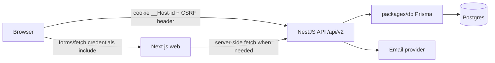

# V2 - Thiết kế hệ thống Auth

> Trạng thái: bản nghiên cứu và đặc tả triển khai cho V2. Spec thắng code.
>
> Phạm vi: authentication, session management, authorization nền tảng, cookie/CORS/CSRF, schema dữ liệu, API contract và roadmap implement. Tài liệu này không thay thế security review trước production.

## 1. Bối cảnh hiện tại

KeyLish V1 là ứng dụng học từ vựng local-first. Backend NestJS hiện mới phục vụ API đọc kho từ vựng:

- Web: `apps/web` - Next.js App Router, React, TypeScript.
- API: `apps/api` - NestJS + Express, global prefix `/api`, URI versioning.
- DB: `packages/db` - Prisma + PostgreSQL.
- Shared: `packages/shared` - Zod schema/type dùng chung.
- Production hiện tại: Vercel web, Render API, Neon Postgres.

Hiện chưa có `User`, auth module, session store, email flow hay protected route. Trong UI mới có khu vực sidebar để đặt nút đăng nhập/đăng ký sau này.

## 2. Mục tiêu V2

Auth V2 phải mở khóa các tính năng có dữ liệu người dùng:

- Tài khoản người học: email, tên hiển thị, avatar tùy chọn.
- Đồng bộ tiến độ học giữa thiết bị: phiên typing, từ đã học, từ sai, streak, preference.
- Bảo vệ endpoint ghi/xem dữ liệu cá nhân.
- Cho phép reset mật khẩu, đổi mật khẩu, đăng xuất từng thiết bị hoặc tất cả thiết bị.
- Đặt nền cho email verification, admin/debug read-only, passkey/OAuth ở các bản sau.

Ngoài phạm vi V2.0:

- Chưa làm billing/subscription.
- Chưa làm SSO doanh nghiệp/SAML.
- Chưa bắt buộc MFA.
- Không lưu token auth trong `localStorage` hoặc IndexedDB.
- Không đưa session/user object đầy đủ xuống client; DTO phải tối thiểu.

## 3. Quyết định kiến trúc

Chọn hướng: **API sở hữu auth, session cookie HttpOnly, session state nằm trong Postgres**.

Lý do:

- Dữ liệu V2 sẽ nằm sau Nest API, nên API phải là điểm quyết định cuối cùng cho authorization.
- Session database giúp revoke/logout-all, theo dõi thiết bị, rotate token và audit dễ hơn JWT stateless.
- Cookie HttpOnly giảm rủi ro token bị lấy qua XSS so với access token trong browser storage.
- Next.js vẫn lấy trạng thái người dùng qua `/api/v2/auth/me` hoặc route handler/server action khi cần.

Không chọn JWT lưu ở browser cho V2. JWT có ích cho mobile/public API, nhưng với web app hiện tại nó làm revoke, CSRF/XSS và refresh-token rotation phức tạp hơn cần thiết.

Không chọn auth nằm hoàn toàn trong Next.js cho V2. Nếu web sở hữu session, Nest API vẫn phải xác minh lại mọi request ghi dữ liệu. Điều này tạo hai nguồn sự thật hoặc buộc phải có BFF đầy đủ. V2 ưu tiên API là source of truth.



## 4. Domain, Cookie Và CORS

Production auth nên có custom domain để tránh third-party cookie và CORS khó debug:

| Thành phần | Khuyến nghị                                                     |
| ---------- | --------------------------------------------------------------- |
| Web        | `https://app.keylish.com` hoặc `https://keylish.com`            |
| API        | `https://api.keylish.com`                                       |
| Cookie     | Set từ API, chỉ gửi về API                                      |
| CORS       | Allow-list origin web thật, `credentials: true`, không wildcard |

Cookie production:

| Thuộc tính | Giá trị                                                         |
| ---------- | --------------------------------------------------------------- |
| Name       | `__Host-id`                                                     |
| Value      | Session token ngẫu nhiên, không chứa user id/email/role         |
| HttpOnly   | `true`                                                          |
| Secure     | `true`                                                          |
| SameSite   | `Lax` khi web/API cùng site; `None` chỉ khi bắt buộc cross-site |
| Path       | `/`                                                             |
| Domain     | Không set domain nếu dùng prefix `__Host-`                      |
| Max-Age    | Theo idle timeout của session                                   |

Development local:

- Web: `http://localhost:3000`.
- API: `http://localhost:3001`.
- Cookie dev có thể dùng name `id`, `secure: false`, `sameSite: "lax"`.
- API `enableCors` phải thêm `credentials: true` và allow origin cụ thể.

Cập nhật cần có trong `apps/api/src/main.ts` khi implement V2:

```ts
app.enableCors({
  origin: allowedOrigins,
  credentials: true,
  methods: ["GET", "POST", "PATCH", "PUT", "DELETE", "OPTIONS"],
  allowedHeaders: ["Content-Type", "X-CSRF-Token"],
});
```

## 5. CSRF Và Request An Toàn

Vì V2 dùng cookie auth, mọi unsafe method phải có CSRF protection.

Baseline:

- `GET /api/v2/auth/csrf` cấp CSRF token cho client.
- Client gửi token qua header `X-CSRF-Token` cho `POST`, `PATCH`, `PUT`, `DELETE`.
- API dùng signed double-submit cookie hoặc thư viện `csrf-csrf`; token được bind với session.
- API kiểm tra `Origin`/`Referer` cho unsafe methods.
- `SameSite=Lax` là lớp phòng thủ bổ sung, không phải cơ chế duy nhất.

Nếu dùng `csrf-csrf` với Express/Nest, middleware cần đăng ký sau cookie parser/session middleware và trước route handler ghi dữ liệu.

## 6. Password Và Account Recovery

V2.0 hỗ trợ email + password. OAuth/passkey mở sau khi session layer ổn định.

Password policy:

- Minimum 12 ký tự cho UX hiện tại; target hardening là 15 ký tự nếu V2 chưa có MFA.
- Cho phép Unicode, dấu cách và passphrase.
- Không bắt buộc composition rule kiểu chữ hoa/số/ký tự đặc biệt.
- Maximum 128 ký tự, không silent truncate.
- Thêm strength meter trên web; backend vẫn validate riêng.
- Login/forgot-password trả lỗi generic, không tiết lộ email tồn tại hay không.

Password storage:

- Dùng Argon2id nếu môi trường deploy hỗ trợ native package.
- Tham số baseline: memory 19 MiB, iterations 2, parallelism 1; tăng dần nếu Render latency cho phép.
- Nếu Argon2id gây vấn đề build native, dùng `bcrypt` tạm thời với cost >= 12 và ghi rõ trade-off trong ADR.
- Password reset token chỉ lưu hash trong DB, token plaintext chỉ gửi qua email một lần.
- Reset password thành công phải revoke tất cả session cũ của user.

Email verification:

- Account mới có `emailVerifiedAt = null`.
- Cho phép login nhưng chặn tính năng ghi quan trọng cho đến khi verify, hoặc chọn policy chặt hơn là bắt verify trước khi tạo cloud progress.
- Verification token hết hạn 24h, resend có rate limit.

## 7. Schema Prisma Đề Xuất

Thêm vào `packages/db/prisma/schema.prisma` trong migration V2:

```prisma
enum UserRole {
  USER
  ADMIN
}

enum UserStatus {
  ACTIVE
  DISABLED
  DELETED
}

enum AuthProvider {
  PASSWORD
  GOOGLE
  GITHUB
  PASSKEY
}

model User {
  id              String      @id @default(cuid())
  email           String      @unique
  emailNormalized String      @unique
  emailVerifiedAt DateTime?
  displayName     String?
  avatarUrl       String?
  role            UserRole    @default(USER)
  status          UserStatus  @default(ACTIVE)
  createdAt       DateTime    @default(now())
  updatedAt       DateTime    @updatedAt
  deletedAt       DateTime?

  identities      AuthIdentity[]
  sessions        AuthSession[]
  authEvents      AuthEvent[]
}

model AuthIdentity {
  id           String       @id @default(cuid())
  userId       String
  provider     AuthProvider
  providerId   String
  passwordHash String?
  createdAt    DateTime     @default(now())
  updatedAt    DateTime     @updatedAt

  user         User         @relation(fields: [userId], references: [id], onDelete: Cascade)

  @@unique([provider, providerId])
  @@index([userId])
}

model AuthSession {
  id             String    @id @default(cuid())
  userId         String
  tokenHash      String    @unique
  csrfSecretHash String?
  userAgent      String?
  ipHash         String?
  createdAt      DateTime  @default(now())
  lastSeenAt     DateTime  @default(now())
  expiresAt      DateTime
  revokedAt      DateTime?

  user           User      @relation(fields: [userId], references: [id], onDelete: Cascade)

  @@index([userId])
  @@index([expiresAt])
  @@index([revokedAt])
}

model AuthToken {
  id        String   @id @default(cuid())
  userId    String
  purpose   String
  tokenHash String   @unique
  expiresAt DateTime
  usedAt    DateTime?
  createdAt DateTime @default(now())

  user      User     @relation(fields: [userId], references: [id], onDelete: Cascade)

  @@index([userId, purpose])
  @@index([expiresAt])
}

model AuthEvent {
  id        String   @id @default(cuid())
  userId    String?
  type      String
  ipHash    String?
  userAgent String?
  metadata  Json?
  createdAt DateTime @default(now())

  user      User?    @relation(fields: [userId], references: [id], onDelete: SetNull)

  @@index([userId])
  @@index([type, createdAt])
}
```

Ghi chú:

- `emailNormalized` = lowercase + trim; không dùng email display làm khóa logic.
- `tokenHash` dùng HMAC-SHA256 hoặc SHA-256 trên token ngẫu nhiên 256-bit + server pepper.
- `ipHash` không lưu IP thô nếu chưa có nhu cầu vận hành rõ ràng.
- Sau khi thêm progress V2, mọi model user-owned phải có `userId` và index phù hợp.

## 8. API Contract V2

Mọi response user phải dùng DTO tối thiểu:

```ts
type AuthUserDto = {
  id: string;
  email: string;
  emailVerified: boolean;
  displayName: string | null;
  avatarUrl: string | null;
  role: "USER" | "ADMIN";
};
```

Endpoints auth:

| Method | Path                               | Auth     | CSRF | Mô tả                                |
| ------ | ---------------------------------- | -------- | ---- | ------------------------------------ |
| GET    | `/api/v2/auth/csrf`                | optional | no   | Cấp CSRF token                       |
| POST   | `/api/v2/auth/register`            | no       | yes  | Tạo user + password identity         |
| POST   | `/api/v2/auth/login`               | no       | yes  | Xác thực, rotate/set session cookie  |
| POST   | `/api/v2/auth/logout`              | yes      | yes  | Revoke current session, clear cookie |
| POST   | `/api/v2/auth/logout-all`          | yes      | yes  | Revoke tất cả session của user       |
| GET    | `/api/v2/auth/me`                  | optional | no   | Trả current user hoặc `null`         |
| POST   | `/api/v2/auth/verify-email`        | no       | yes  | Verify email token                   |
| POST   | `/api/v2/auth/resend-verification` | yes      | yes  | Gửi lại verification email           |
| POST   | `/api/v2/auth/forgot-password`     | no       | yes  | Gửi email reset nếu account tồn tại  |
| POST   | `/api/v2/auth/reset-password`      | no       | yes  | Reset bằng token, revoke sessions    |
| POST   | `/api/v2/auth/change-password`     | yes      | yes  | Yêu cầu mật khẩu hiện tại            |
| GET    | `/api/v2/auth/sessions`            | yes      | no   | Liệt kê thiết bị đang đăng nhập      |
| DELETE | `/api/v2/auth/sessions/:id`        | yes      | yes  | Revoke một session                   |

Protected endpoints sau auth:

- `GET/PUT /api/v2/me/preferences`.
- `GET /api/v2/me/progress/summary`.
- `POST /api/v2/practice/sessions`.
- `POST /api/v2/vocab/:wordId/mastery`.

V1 vocab endpoint vẫn có thể public. Khi tạo endpoint mới, dùng `/api/v2/*` để không phá client V1.

## 9. NestJS Module Design

Đề xuất cấu trúc:

```txt
apps/api/src/auth/
  auth.module.ts
  auth.controller.ts
  auth.service.ts
  password.service.ts
  session.service.ts
  csrf.service.ts
  mail.service.ts
  auth.guard.ts
  verified-email.guard.ts
  current-user.decorator.ts
  dto.ts
```

Responsibilities:

- `AuthController`: HTTP contract, cookie set/clear, DTO only.
- `AuthService`: register/login/reset/change-password orchestration.
- `SessionService`: create, rotate, verify, revoke, cleanup expired session.
- `PasswordService`: hash/verify password; hide Argon2/bcrypt details.
- `CsrfService`: generate/validate token bound to session.
- `AuthGuard`: đọc cookie, verify session, attach `request.user`.
- `VerifiedEmailGuard`: gate các endpoint cần email verified.
- `CurrentUser` decorator: lấy user DTO trong controller.

Không đưa Prisma model raw về controller. Mọi service trả DTO hoặc domain object đã sanitize.

## 10. Next.js Web Integration

Đề xuất route/UI:

```txt
apps/web/src/app/(auth)/login/page.tsx
apps/web/src/app/(auth)/register/page.tsx
apps/web/src/app/(auth)/forgot-password/page.tsx
apps/web/src/app/(auth)/reset-password/page.tsx
apps/web/src/app/(app)/settings/account/page.tsx
apps/web/src/infra/auth/authApi.ts
apps/web/src/infra/auth/session.ts
```

Client/API rules:

- Mọi fetch tới API có cookie phải dùng `credentials: "include"`.
- Không đọc session cookie bằng JS; UI lấy user qua `/api/v2/auth/me`.
- Không lưu access token trong `localStorage`.
- Auth form validate client cho UX, server/API validate lại bằng Zod.
- Protected UI có thể redirect sớm, nhưng API guard là lớp bảo vệ bắt buộc.
- Nếu production vẫn dùng `vercel.app` + `onrender.com`, cần BFF route handler trong Next để tránh third-party cookie. Khuyến nghị mạnh: custom domain trước khi release auth.

## 11. Authorization Policy

Baseline roles:

| Role    | Quyền                                                                         |
| ------- | ----------------------------------------------------------------------------- |
| `USER`  | Đọc public vocab, ghi/xem dữ liệu của chính mình                              |
| `ADMIN` | V2.1+, đọc dashboard vận hành; không sửa dữ liệu người dùng nếu chưa có audit |

Rules:

- Mọi query user-owned data phải filter theo `userId` từ session, không tin `userId` từ body/client.
- Guard chỉ trả 401/403; service vẫn phải enforce ownership.
- DTO không bao giờ trả `passwordHash`, `tokenHash`, reset token, ipHash, internal metadata.
- Sensitive action như đổi email, đổi password, delete account cần re-auth hoặc password confirm.

## 12. Rate Limit, Logging Và Monitoring

Cần thêm `@nestjs/throttler` hoặc middleware tương đương:

| Flow                | Giới hạn đề xuất                                          |
| ------------------- | --------------------------------------------------------- |
| Login               | Per IP + per email, exponential backoff sau nhiều lần sai |
| Register            | Per IP/email                                              |
| Forgot password     | Per IP/email, response generic                            |
| Resend verification | Per user/email                                            |
| CSRF token          | Per session/IP nhẹ                                        |

Auth event nên log:

- `auth.registered`
- `auth.login.succeeded`
- `auth.login.failed`
- `auth.logout`
- `auth.password_reset.requested`
- `auth.password_reset.completed`
- `auth.email_verified`
- `auth.session.revoked`

Không log password, token plaintext, raw cookie, reset link đầy đủ, hoặc PII không cần thiết.

## 13. Env Vars V2

Thêm vào `.env.example` và production secrets khi implement:

```env
# Auth
AUTH_ALLOWED_ORIGINS=http://localhost:3000,https://app.keylish.com
AUTH_COOKIE_NAME=__Host-id
AUTH_SESSION_SECRET=<openssl-rand-base64-32-or-longer>
AUTH_CSRF_SECRET=<openssl-rand-base64-32-or-longer>
AUTH_SESSION_IDLE_DAYS=30
AUTH_SESSION_ABSOLUTE_DAYS=90
AUTH_REQUIRE_EMAIL_VERIFICATION=true

# Email
EMAIL_PROVIDER=resend
EMAIL_FROM=KeyLish <no-reply@keylish.com>
RESEND_API_KEY=

# Optional hardening
AUTH_ARGON2_MEMORY_KIB=19456
AUTH_ARGON2_ITERATIONS=2
AUTH_ARGON2_PARALLELISM=1
```

## 14. Roadmap Implement

### Phase 0 - Chốt hạ tầng

- Chọn custom domain cho web/API.
- Chốt email provider: Resend, Postmark hoặc AWS SES.
- Tạo env secrets cho local/staging/production.
- Cập nhật CORS có `credentials: true` và allow-list origin.

### Phase 1 - DB migration

- Thêm Prisma models: `User`, `AuthIdentity`, `AuthSession`, `AuthToken`, `AuthEvent`.
- Generate Prisma client.
- Viết seed admin optional cho local.

### Phase 2 - API auth core

- Tạo `AuthModule` và services.
- Thêm cookie parser, CSRF middleware, rate limit.
- Implement register/login/logout/me.
- Thêm OpenAPI security schema cho cookie auth.

### Phase 3 - Web auth UI

- Thêm route login/register/forgot/reset.
- Nối `authApi.ts`, CSRF bootstrap và `credentials: "include"`.
- Sidebar hiện trạng thái đăng nhập, nút logout.
- Account settings có form đổi display name/password.

### Phase 4 - User-owned progress

- Thiết kế progress schema riêng.
- Protect endpoint ghi tiến độ bằng `AuthGuard`.
- Local-first migration: merge IndexedDB progress lên cloud sau login với màn hình confirm.

### Phase 5 - Recovery và verification

- Email verification.
- Forgot/reset password.
- Logout all devices.
- Auth event screen tối thiểu trong account settings.

### Phase 6 - Hardening

- Test CSRF/CORS/cookie trên production domain.
- Brute-force test và rate-limit test.
- Dependency audit.
- Security review trước release public.

## 15. Checklist Kiểm Thử

API unit/integration:

- Password hash/verify đúng và reject sai password.
- Session token được hash trong DB, cookie không chứa user data.
- Login rotate session, logout revoke session.
- Expired/revoked session trả 401.
- Forgot password response generic cho email tồn tại/không tồn tại.
- Reset password revoke tất cả session cũ.
- CSRF thiếu/sai token bị reject trên unsafe methods.
- CORS không cho origin ngoài allow-list, không dùng wildcard với credentials.
- Ownership check: user A không đọc/sửa dữ liệu user B.

Web e2e:

- Register -> verify email -> login -> sidebar đổi trạng thái.
- Login sai hiện lỗi generic, không leak email existence.
- Refresh page vẫn giữ session.
- Logout clear UI và API `/me` trả null.
- Protected page redirect khi chưa login.
- Cross-device logout-all làm session cũ mất hiệu lực.

Manual production smoke test:

- Cookie có `HttpOnly`, `Secure`, `SameSite`, `Path=/`.
- `Set-Cookie` không có `Domain` nếu dùng `__Host-`.
- Request từ Vercel preview không được allow nếu không nằm trong allow-list.
- DevTools không có token auth trong localStorage/sessionStorage.

## 16. Câu Hỏi Cần Chốt Trước Khi Code

- Domain production chính thức là gì: `keylish.com`, `app.keylish.com`, hay tiếp tục `vercel.app`?
- Auth V2.0 có bắt email verification trước khi sync progress không?
- Có cần social login Google ngay V2.0 không, hay để V2.1?
- Local progress sau login: auto merge, hỏi người dùng, hay ghi đè cloud?
- Có cần delete account/export data trong V2.0 để phù hợp kỳ vọng privacy không?

## 17. Nguồn Tham Chiếu

- [OWASP Authentication Cheat Sheet](https://cheatsheetseries.owasp.org/cheatsheets/Authentication_Cheat_Sheet.html)
- [OWASP Session Management Cheat Sheet](https://cheatsheetseries.owasp.org/cheatsheets/Session_Management_Cheat_Sheet.html)
- [OWASP CSRF Prevention Cheat Sheet](https://cheatsheetseries.owasp.org/cheatsheets/Cross-Site_Request_Forgery_Prevention_Cheat_Sheet.html)
- [OWASP Password Storage Cheat Sheet](https://cheatsheetseries.owasp.org/cheatsheets/Password_Storage_Cheat_Sheet.html)
- [Next.js Authentication Guide](https://nextjs.org/docs/app/guides/authentication)
- [Next.js Backend for Frontend Guide](https://nextjs.org/docs/app/guides/backend-for-frontend)
- [Next.js Data Security Guide](https://nextjs.org/docs/app/guides/data-security)
- [NestJS Authentication](https://docs.nestjs.com/security/authentication)
- [NestJS CORS](https://docs.nestjs.com/security/cors)
- [NestJS CSRF](https://docs.nestjs.com/security/csrf)
- [NestJS Rate Limiting](https://docs.nestjs.com/security/rate-limiting)
